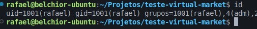
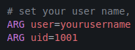

# Sistema Web de Gestão de Produtos e Fornecedores


# OBS: (Importante ressaltar que você deve ter em sua máquina instalada o docker para rodar e testar o projeto)


## Instalação do projeto

## Clone Repositório
```
git clone git@github.com:rafPH1998/teste-virtual-market.git
cd teste-virtual-market
```

## Crie o Arquivo .env

```
cp .env.example .env
```

## Suba os containers do projeto

```
docker compose up -d
```

## Entre dentro do container

```
 docker compose exec app bash
```

## Dentro do container, rode o comando abaixo para gerar as dependencias do projeto

```
composer install
```

## Gere a key do projeto ainda dentro do container

```
php artisan key:generate
```

# Caso gere erro ao rodar composer install, é importante saber o id que se encontra o seu usuário



Verifique se o ID esta igual ao do arquivo Dockerfile, caso não estiver, deixe o ID do dockerfile similar ao do usuario. Rode docker compose up --build para subir os container de novo e tente o processo novamente.



